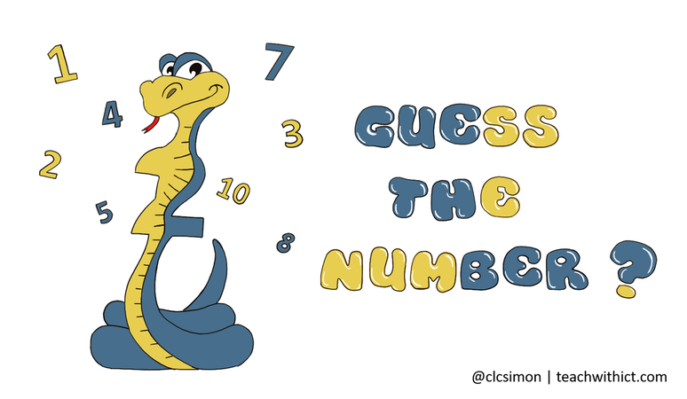

# 🎯 Guess the Number Game (JavaScript)



## 📝 Description

A simple JS console application where the computer secretly picks a number within a certain range, and the player’s objective is to find it by guessing.  
After each attempt, the program gives feedback whether the target number is greater or smaller than the guess.  
The game continues until the correct number is found.

---

## 📖 Game Concept

1. The computer generates a hidden number within a given range (e.g., 1–100).
2. The player enters guesses and receives hints:
   - If the guess is too low → the program indicates “higher”.
   - If the guess is too high → the program indicates “lower”.
3. The game ends when the number is guessed correctly.
4. Players can choose to start a new round after winning.

---

## 🎯 Core Requirements

- **Random Number Generation:** Pick a number between 1 and 100 (or different range for other levels).  
- **Player Input:** Read and validate the guessed number.  
- **Hints:** Indicate whether the secret number is higher or lower than the guess.  
- **Input Validation:** Handle invalid entries with an error message.  
- **Replay Option:** After a correct guess, ask if the player wants to play again.  
- **Level Progression:** Higher levels can increase the range.  
- **Attempt Tracking:** Count how many guesses are made per round.  
- **Code Structure:** Keep logic organized and separated into methods.

---

## 🛠 Technologies Used

- **Language:** JS 
- **Environment:** Visual Studio Code  
- **Type:** Console Application

---

## ▶️ Running the Game

1. Clone or download this repository.  
2. Open the project in Visual Studio or Visual Studio Code.  
3. Build and run the application.  
4. Follow the console instructions to play.

---

## 📂 Main Methods

- `GenerateRandomNumber(int min, int max)` → Creates a random number within the given bounds.  
- `ReadUserGuess()` → Reads and validates player input.  
- `PrintHint(int guess, int secretNumber)` → Shows if the target number is higher or lower.  
- `PlayGame(int level, int min, int max)` → Main game loop with input handling and attempt counting.  
- `AskToPlayAgain()` → Checks if the player wants another round and moves to the next level.  
- `Main()` → Program entry point.

---

## 💡 Possible Improvements

- ⏱ Add a timer or time limit for each round.  
- 📊 Display progress statistics.  
- 💾 Save high scores to a file.  
- 🎮 Include multiple difficulty settings.  
- 🔧 Let the player define a custom range.

---

## 📜 License

This project is distributed under the **MIT License**.

---

## 💻 Sample Output

```text
Level: 1 (1 - 100)
Guess the number: 50
Your guess is higher than the secret number.

Guess the number: 25
Your guess is lower than the secret number.

Guess the number: 37
Congratulations! You guessed the number in 3 attempts.

Do you want to play again? (y/n): n
Thanks for playing!

---

